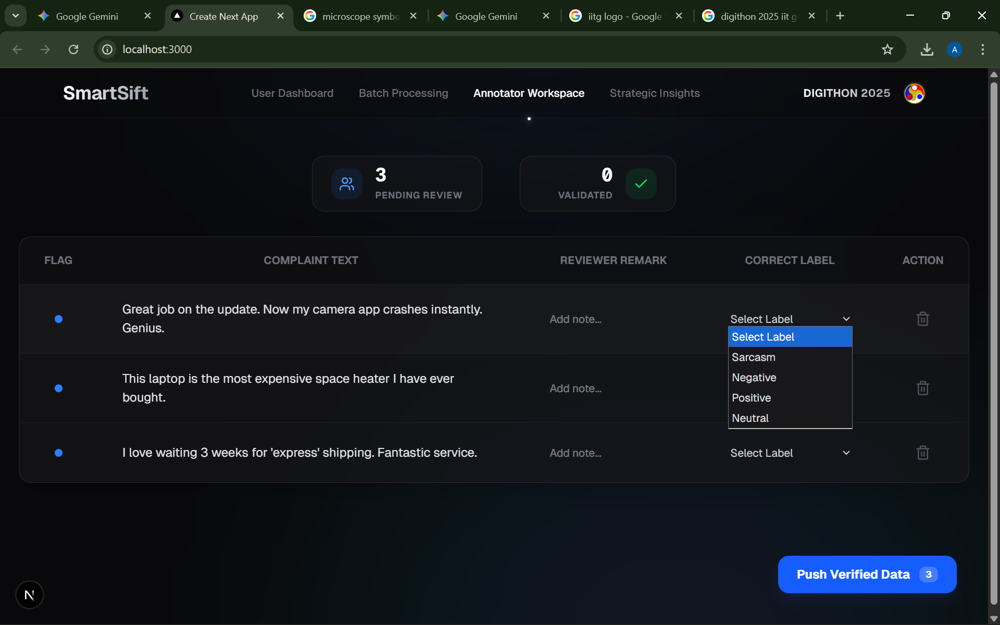

# SmartSift

**Intelligent Complaint Triage System**  
Digithon 2025 Submission | IIT Guwahati  

SmartSift is a high-performance, hybrid AI system designed to transform how customer support teams handle large volumes of product complaints. By combining a low-latency CPU-based router with a high-intelligence GPU-based analyst, SmartSift automates complaint triage, reduces operational costs, and converts raw feedback into actionable engineering insights.

---

## Problem Overview

Modern customer support systems face three critical challenges:

- **Volume Overload** – Thousands of tickets ranging from trivial administrative queries to critical hardware failures.
- **High Latency** – Manual triage delays responses and frustrates users.
- **Lost Intelligence** – Recurring product issues remain hidden in unstructured complaint text.

SmartSift addresses these issues using a tiered AI architecture that is fast, cost-efficient, and reliable by design.

---

## System Architecture  
### Tiered Intelligence Pipeline (The 85/15 Rule)

### Tier 1: CPU Router (Local, Low Cost)
- **Model:** Sentence Transformers (MiniLM family)
- **Role:** Instantly analyzes incoming complaints using semantic similarity
- **Outcome:** Auto-resolves ~85% of simple queries in milliseconds without cloud inference

### Tier 2: GPU Analyst (Cloud, High Intelligence)
- **Model:** Llama 3 (via Groq API)
- **Role:** Deep analysis of complex, ambiguous, or high-risk complaints
- **Outcome:** Identifies root causes, affected devices, and failure patterns

---

## Key Features

### 1. User Dashboard (Single Complaint Analysis)
- Real-time complaint testing
- Transparent routing decision (CPU vs GPU)
- Aspect-based sentiment analysis with reasoning

---

### 2. Batch Processing Engine
- Upload and analyze CSV datasets
- Automatic separation of trivial vs critical issues
- Efficiency metrics and action tagging

---

### 3. Annotator Workspace (Human-in-the-Loop)
- Review AI-flagged complaints (sarcasm, mixed sentiment)
- Human corrections persisted for future retraining
- Prevents silent model failure and model drift

---

### 4. Strategic Insights Dashboard
- Executive-level aggregation of complaint history
- Risk Radar highlighting emerging technical failures
- AI-generated recommended action plans

---

## Tech Stack

| Component | Technology |
|--------|------------|
| Frontend | Next.js (React) |
| Styling | Tailwind CSS |
| Animations | Framer Motion |
| Backend | FastAPI (Python) |
| Local AI | Sentence Transformers |
| Cloud AI | Llama 3 via Groq API |
| Data Layer | CSV / Pandas (MVP) |

---

## Local Setup

### Backend (FastAPI)
Bash

pip install -r requirements.txt

uvicorn app.main:app --reload

Backend runs on: http://localhost:8000

---

### Frontend (Next.js)
Bash

cd frontend

npm install 

npm run dev

Frontend runs on: http://localhost:3000

---

## Future Roadmap
PostgreSQL + Vector DB integration

CRM connectors (Zendesk, Salesforce)

Voice complaint analysis using speech-to-text models

Continuous retraining pipelines

---

## Contact
Nakibul Islam 
Email: nakibul.sci@gmail.com
